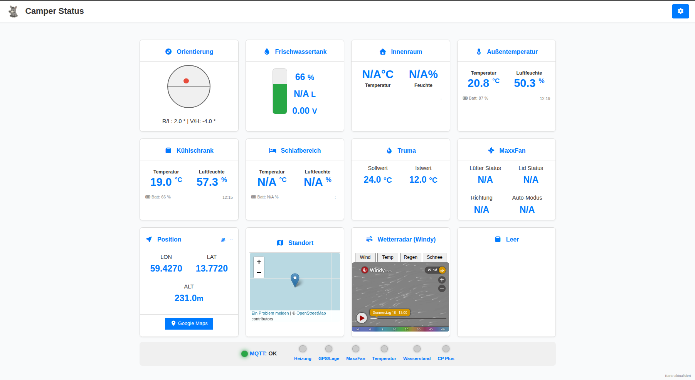
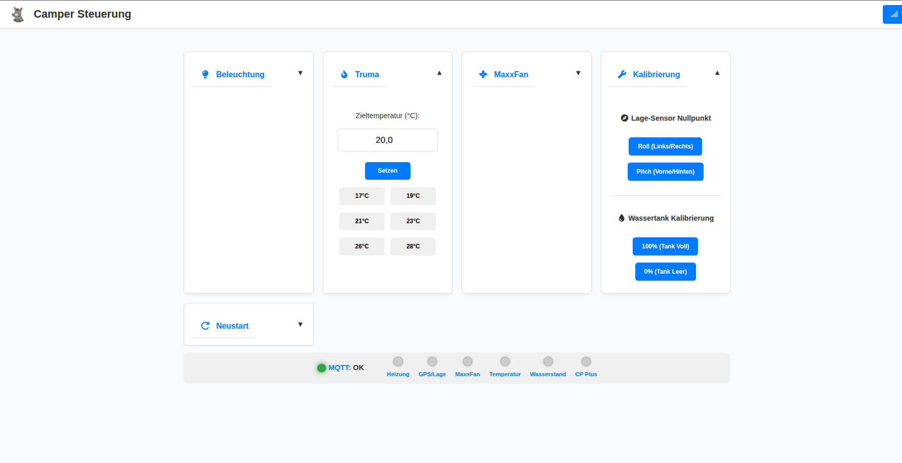

# 🚐 Camper Control Dashboard

Ein modernes, responsives Web-Dashboard zur Überwachung und Steuerung von Wohnmobil-Komponenten über MQTT. Optimiert für die Nutzung auf Tablets (z.B. iPad) oder Smartphones im Camper-Netzwerk.

## ✨ Features

- **📍 GPS & Standort:** Live-Anzeige von LAT/LON, Höhe und Satellitenanzahl. Inklusive interaktiver OpenStreetMap-MiniMap und direktem Google Maps Link.
- **☁️ Wetterradar:** Integriertes Windy-Radar für Wind, Regen, Temperatur und Schnee (automatisch auf den aktuellen Standort zentriert).
- **🌡️ Multi-Zonen Klima:** Überwachung von mehreren Govee Bluetooth-Sensoren (Innenraum, Außen, Kühlschrank, Schlafbereich).
- **🔥 Truma Steuerung:** Anzeige von Soll- und Ist-Temperatur sowie Steuerung der Heizung.
- **🌀 MaxxFan Control:** Vollständige Steuerung des Dachlüfters (Modus, Richtung, Geschwindigkeit, Deckel).
- **💧 Wasserstand:** Visualisierung des Frischwassertanks (Prozent, Volumen und ADC-Spannung).
- **⚖️ Orientierung:** Visuelle Anzeige der Fahrzeugneigung (Roll & Pitch) zur perfekten Ausrichtung beim Parken.
- **🛠 System-Status:** Live-Überwachung der Konnektivität aller ESP-Nodes via MQTT LWT (Last Will and Testament).

## 🚀 Tech Stack

- **Frontend:** HTML5, CSS3 (Grid & Flexbox), Modern JavaScript (ES6+).
- **Kommunikation:** MQTT über WebSockets (`mqtt.js`).
- **MQTT Bridge:**  Python Bridge mit ATOMLite openmqttgateway.com
- **Icons:** FontAwesome 6.
- **Karten:** OpenStreetMap Embed & Windy API.
- **PWA:** Service Worker Integration für Offline-Caching und "Add to Homescreen" Support.

## 📸 Screenshots

> _Hinweis: Die Screenshots zeigen das Dashboard im Hell-Mode-Design mit aktiven Live-Daten und Karten-Integration. Dark-Mode ist auch vorhanden.

## 🛠 Installation & Setup

Repository klonen

Konfiguration:

Benenne die Datei config.example.js in config.js um.

Trage deine MQTT-Broker Daten (IP, User, Passwort) und die entsprechenden Topics ein.

Deployment:

Da das Dashboard auf WebSockets basiert, reicht ein einfacher Webserver (Nginx, Apache) oder sogar das Ausführen über ein NAS / Raspberry Pi.
Meine Vorlage basiert auf einem OpenWrt Router

Wichtig: Der MQTT-Broker (z.B. Mosquitto) muss WebSockets auf einem eigenen Port (meist 9001) unterstützen.

Struktur
index.html: Das Haupt-Dashboard mit allen Anzeigen.

control.html: Die Steuerungsseite für Heizung, Licht und Lüfter.

style.css: Modernes Dark-Mode Design mit Glas-Effekt-Kacheln.

sw.js: Service Worker für die PWA-Funktionalität.

config.js: Zentrale Konfiguration (nicht im Git tracken!).

MQTT Bridge (Python)
Da die Govee-Sensoren über Bluetooth Low Energy (BLE) kommunizieren, nutzt dieses Dashboard eine Python-basierte Bridge (z.B. auf einem Raspberry Pi oder dem Camper-Router), um die Daten in das MQTT-Netzwerk zu übersetzen.

Funktionsweise:

Die Bridge holt die Daten von einem ESM mit openmqttgateway.com 

Die Rohdaten (Temperatur, Feuchtigkeit, Batterie) werden in ein strukturiertes JSON-Format umgewandelt.

Diese JSON-Daten werden auf den entsprechenden Topics (z.B. GOVEE_TEMP_TOPIC_1) veröffentlicht.

Beispiel für ein Datenpaket (Payload):

JSON

{
  "tempc": 21.5,
  "hum": 45.2,
  "batt": 98,
  "time": "14:20"
}
Das Dashboard parst dieses JSON automatisch und aktualisiert die entsprechenden Kacheln (Außen, Kühlschrank, Schlafbereich).

Topic-Struktur: Stelle sicher, dass die in der Bridge definierten MQTT-Topics exakt mit denen in deiner config.js übereinstimmen, damit das Dashboard die Daten findet.

Als Wassersensor nutze ich einen Sensor von smaker3D https://shop.smaker3d.eu/collections/stream-waterlevel

⚠️ Sicherheitshinweise
Netzwerk: Dieses Dashboard ist für die Nutzung im lokalen Camper-WLAN konzipiert. Für den Fernzugriff wird ein VPN (z.B. WireGuard) empfohlen.

📝 Lizenz
Dieses Projekt ist unter der MIT-Lizenz lizenziert - siehe die LICENSE Datei für Details.
